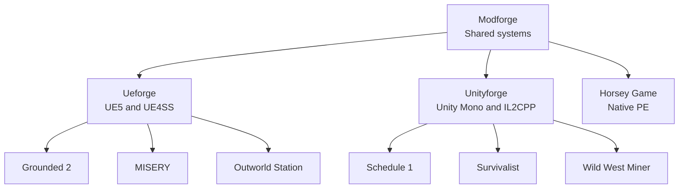

# modforge

> **Vibecoded.** This repository is AI-generated under human direction and review.

A Rust toolkit for building mods across Unreal Engine, Unity,
and native games.

Ueforge supports UE5 mods, Unityforge supports Unity mods, and
native games such as Horsey Game use Modforge directly.

## modforge

Engine-independent systems usable by a mod or a standalone game.

| Category | Capabilities |
|---|---|
| Control | [Arguments](modforge/src/args.rs), [Envelope](modforge/src/envelope.rs), [Operations](modforge/src/ops.rs), [Server](modforge/src/server.rs), [Client](modforge/src/client/mod.rs), [Debug](modforge/src/debug.rs), [Snapshots](modforge/src/snapshots/mod.rs) |
| Lifecycle | [Settings](modforge/src/settings.rs), [Logging](modforge/src/log.rs), [Shutdown](modforge/src/shutdown.rs), [Reload](modforge/src/hot_reload.rs), [Workers](modforge/src/worker.rs) |
| Telemetry | [Counters](modforge/src/counters.rs), [Rings](modforge/src/ring.rs) |
| Native | [Hooks](modforge/src/hook.rs), [Vanilla](modforge/src/vanilla/mod.rs), [SEH](modforge/src/seh.rs) |
| Research | [Patterns](modforge/src/patterns/mod.rs), [Scanning](modforge/src/scanner.rs), [Processes](modforge/src/winproc.rs), [Research](modforge/src/research.rs), [Minidumps](modforge/src/bin/minidump.rs) |
| Input | [Input](modforge/src/input/mod.rs), [Actions](modforge/src/actions.rs) |
| UI | [UI](modforge/src/ui/mod.rs), [HUD](modforge/src/hud.rs) |
| Items | [Items](modforge/src/item.rs), [Quality](modforge/src/quality.rs), [Crafting](modforge/src/crafting.rs) |
| Progression | [Upgrades](modforge/src/upgrade.rs), [RPG](modforge/src/rpg/mod.rs) |
| Actors | [Actors](modforge/src/actor.rs), [Decisions](modforge/src/brain.rs), [Memory](modforge/src/memory.rs) |
| Conflict | [Combat](modforge/src/combat.rs), [Factions](modforge/src/faction.rs) |
| Society | [Genomes](modforge/src/genome.rs), [Missions](modforge/src/mission.rs) |
| Survival | [Survival](modforge/src/survival.rs) |
| Storytelling | [Storytelling](modforge/src/storyteller.rs), [Dread](modforge/src/unknown.rs) |
| World | [Biomes](modforge/src/biome.rs), [Structures](modforge/src/structure.rs), [Monuments](modforge/src/monument.rs), [Worlds](modforge/src/worldgen.rs), [Rolls](modforge/src/roll.rs) |
| Testing | [Testkit](modforge/src/testkit/mod.rs), [Harness](modforge/src/harness/mod.rs) |
| Delivery | [Deploy](modforge/src/bin/modforge_deploy.rs) |

See [`modforge/README.md`](modforge/README.md) and
[`modforge/docs/`](modforge/docs/).

## ueforge

The Unreal Engine 5 and UE4SS binding layer.

| Category | Capabilities |
|---|---|
| Lifecycle | [Lifecycle](ueforge/src/mod_main.rs), [Shim](ueforge/cpp/ueforge_shim.cpp), [Features](ueforge/src/features.rs), [Shutdown](ueforge/src/shutdown.rs), [Reload](ueforge/src/hot_reload.rs) |
| Runtime | [Objects](ueforge/src/ue/uobject.rs), [Functions](ueforge/src/ue/pe_call.rs), [GObjects](ueforge/src/ue/core_types.rs), [Names](ueforge/src/ue/fname.rs), [Strings](ueforge/src/ue/fstring.rs), [Arrays](ueforge/src/ue/tarray.rs), [Fields](ueforge/src/ue/field.rs), [Parameters](ueforge/src/parms.rs), [Offsets](ueforge/src/ue/offsets.rs) |
| Hooks | [ProcessEvent](ueforge/src/hook/process_event.rs), [Vtables](ueforge/src/hook/vtable.rs), [Falls](ueforge/src/fall.rs), [Damage](ueforge/src/damage/mod.rs), [Frames](ueforge/src/frame.rs), [Queue](ueforge/src/game_thread.rs) |
| Data | [DataTables](ueforge/src/data_table.rs), [Tweaks](ueforge/src/tweak.rs), [Dynamic](ueforge/src/dynamic_tweaks.rs), [Discovery](ueforge/src/discovery.rs), [Assets](ueforge/src/assets.rs), [Uassets](ueforge/src/uasset.rs) |
| Gameplay | [RPG](ueforge/src/rpg/mod.rs), [Inventory](ueforge/src/inventory/viewport.rs), [Statuses](ueforge/src/ue/status_effect.rs) |
| UI | [ImGui](ueforge/src/ui.rs), [Classes](ueforge/src/ui_class_browser.rs), [Structs](ueforge/src/ui_struct_browser.rs), [Tables](ueforge/src/ui_data_table_browser.rs), [Scanner](ueforge/src/ui_scanner.rs), [TweakUI](ueforge/src/ui_tweaks.rs) |
| Control | [Selectors](ueforge/src/selector.rs), [Operations](ueforge/src/ops.rs), [Scanning](ueforge/src/scanner.rs), [Counters](ueforge/src/counters.rs), [Snapshots](ueforge/src/debug/mod.rs), [HTTP](ueforge/src/server.rs) |
| Testing | [Client](ueforge/src/client/mod.rs), [Scenarios](modforge/src/client/scenario.rs), [Builds](ueforge/src/build.rs) |

See [`ueforge/README.md`](ueforge/README.md) and
[`ueforge/docs/`](ueforge/docs/).

## unityforge

The Unity Mono and IL2CPP binding layer.

| Category | Capabilities |
|---|---|
| Loaders | [BepInEx](unityforge/cs-shim-mono/Plugin.cs), [MelonLoader](unityforge/cs-shim-melonloader/Mod.cs), [Survivalist](unityforge/cs-shim-survivalist/Main.cs) |
| Lifecycle | [Lifecycle](unityforge/src/mod_main.rs) |
| Bridges | [Mono](unityforge/src/mono.rs), [IL2CPP](unityforge/src/il2cpp.rs), [Shim](unityforge/cs-shim-common/HarmonyBridge.cs) |
| Hooks | [Hooks](unityforge/src/hook.rs) |
| Runtime | [Objects](unityforge/src/unity.rs), [Selectors](unityforge/src/selector.rs), [Input](unityforge/src/input.rs), [Queue](unityforge/src/main_thread_queue.rs) |
| RPG | [Effects](unityforge/src/rpg/std_effect.rs), [Triggers](unityforge/src/rpg/trigger_harmony.rs), [Skills](unityforge/src/rpg/skill.rs), [Tracking](unityforge/src/rpg/tracker.rs), [Identity](unityforge/src/rpg/slot_key.rs) |
| Control | [Operations](unityforge/src/ops.rs), [Client](unityforge/src/client.rs) |

See [`unityforge/README.md`](unityforge/README.md) and
[`docs/unityforge-plan.md`](docs/unityforge-plan.md).

## Game-side mods

| Game | Engine / loader | Purpose | Rating |
|---|---|---|---|
| [Grounded 2](grounded2-mod/) | ueforge (UE5 / UE4SS) | Adds persistent RPG progression and survival-focused character customization. | 4/10 |
| [MISERY](misery-mod/) | ueforge (UE5 / UE4SS) | Provides runtime controls for survival balance, movement, vendors, and emission timing. | 2/10 |
| [Outworld Station](outworld-station-mod/) | ueforge (UE5 / UE4SS) | Adjusts item stack sizes through live Unreal Engine data tables. | 3/10 |
| [Schedule 1](schedule1-mod/) | unityforge (IL2CPP / MelonLoader) | Adds combat progression, farming rewards, and kill-driven loot. | 3/10 |
| [Survivalist](survivalist-mod/) | unityforge (native mod loader) | Builds an evolving survival sandbox around factions, settlements, missions, and adaptive events. | 1/10 |
| [Wild West Miner](wwm-mod/) | unityforge (Mono / BepInEx) | Experiments with RPG progression and removes demo movement restrictions. | 2/10 |
| [Horsey Game](horsey-mod/) | modforge (PE inject) | Provides an injectable research and control layer for Horsey Game state. | 3/10 |
| [Scrap Mechanic](scrapmechanic-mod/) | Lua (native) | Rebalances survival inventory, fuel use, building limits, and respawn rates. | 3/10 |
| [Quasimorph](quasimorph-mod/) | C# (native mod API) | Provides a minimal C# scaffold for the game's first-party mod API. | 1/10 |
| (il2cpp-smoke) | unityforge (IL2CPP) | Exercises the Unity IL2CPP integration end to end. | n/a |

> **Rating scale:** 10/10 = ready for 1000 players, fun, zero bugs.

## Docs

Workspace-level docs live in [`docs/`](docs/):
[`todo.md`](docs/todo.md),
[`changelog.md`](docs/changelog.md),
[`unityforge-plan.md`](docs/unityforge-plan.md).
Per-mod docs are linked in the table above. Framework docs:
[`ueforge/`](ueforge/README.md),
[`unityforge/`](unityforge/).
Research tooling:
[`decomp/`](decomp/README.md) (r2sleigh-based, WSL-only),
[`falcon-printer/`](falcon-printer/) (retired prototype, docs only).
